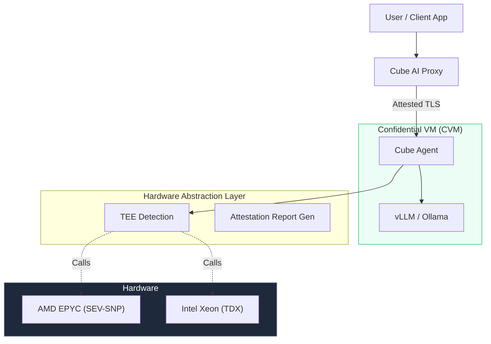

In the rapidly evolving landscape of [Confidential Computing](/blog/confidential-computing-meets-ai), hardware-based isolation is the foundation of trust. For security engineers and infrastructure teams, understanding the underlying Trusted Execution Environment (TEE) technologies is crucial for deploying secure AI workloads.

Cube AI is designed to run seamlessly on the two leading hardware-based TEE platforms: **AMD SEV-SNP** and **Intel TDX**. 

This post provides a technical comparison of these technologies and explains how Cube AI abstracts their complexities to provide a unified, secure platform for your AI models.

<!--truncate-->

## Overview: The Hardware Roots of Trust

Both AMD and Intel have developed robust technologies to solve the same problem: **protecting data in use from the host infrastructure**. However, they approach the architecture slightly differently.

### AMD SEV-SNP (Secure Encrypted Virtualization - Secure Nested Paging)

AMD SEV-SNP is the third generation of AMD's confidential computing technology. It builds upon the memory encryption of the original SEV and the register protection of SEV-ES.

*   **Key Mechanism**: Memory Encryption Key (MEK) management is handled by the **AMD Secure Processor (ASP)**, a dedicated ARM core on the die.
*   **Integrity Protection**: "Secure Nested Paging" (SNP) adds strong integrity protection to prevent hypervisors from remapping memory (e.g., integrity checks on page table lookups).
*   **VMPL (Virtual Machine Privilege Levels)**: SEV-SNP introduces VMPL rings (0-3), allowing a guest VM to run a "paravisor" or other privileged components within the CVM that are more privileged than the guest OS but less privileged than the hardware root of trust.

**Further Reading**: [AMD SEV-SNP Specification](https://www.amd.com/en/technologies/se/secure-encrypted-virtualization) | [AMD Secure Processor Technical Reference](https://developer.amd.com/sev/)

### Intel TDX (Trust Domain Extensions)

Intel TDX creates an architectural isolation boundary known as a **Trust Domain (TD)**.

*   **Key Mechanism**: The **Intel TDX Module** is a software module that runs in a special CPU mode (SEAM - Secure Arbitration Mode) to manage valid transitions between the host and the guest (TD).
*   **MKTME (Multi-Key Total Memory Encryption)**: Uses AES-128-XTS encryption engines in the memory controller.
*   **Measurement**: TDX provides a comprehensive measurement of the initial VM state, including the firmware (TDVF) and the kernel.

**Further Reading**: [Intel TDX Overview](https://www.intel.com/content/www/us/en/architecture-and-technology/trust-domain-extensions.html) | [Intel TDX Module Documentation](https://software.intel.com/content/www/us/en/develop/download/intel-trust-domain-extension-module-documentation.html)

## Feature Comparison

| Feature | AMD SEV-SNP | Intel TDX |
| :--- | :--- | :--- |
| **Isolation Boundary** | VM (with VMPLs) | Trust Domain (TD) |
| **Memory Encryption** | AES-128 / AES-256 XTS (Engine in Memory Controller) | AES-128-XTS (MKTME) |
| **Attestation Root** | AMD Secure Processor (ASP) | SGX Quoting Enclave (QE) |
| **Register State** | Encrypted (SEV-ES) | Managed by hardware/TDX Module |
| **Key Management** | Cloud Provider independent (mostly) | Cloud Provider independent |

## Security Guarantees & Threat Model

Both technologies operate under a similar threat model, designed to protect against powerful adversaries.

### What is Protected?
*   **Hypervisor Access**: The cloud provider's hypervisor (KVM, Hyper-V) cannot read guest memory. Attempts to read encrypted pages result in ciphertext or exceptions.
*   **Host Admin**: Root access on the physical host does not grant access to the guest VM's memory.
*   **Physical Attacks**: Basic cold-boot attacks are mitigated, though sophisticated physical access to the die itself is often out of scope for standard cloud threat models.

### What is Out of Scope?
*   **Guest OS Vulnerabilities**: If the software *inside* the TEE is compromised (e.g., a vulnerability in the Linux kernel running in the VM), the TEE protects the *execution*, but the attacker is "inside the house." **This is why Cube AI uses a minimal, hardened OS image.**
*   **Denial of Service**: The host can always turn off the VM.

## Cube AI Architecture: The Unified Layer

Cube AI abstracts the differences between SEV-SNP and Intel TDX, allowing you to interface with a single "Confidential AI" API.

When Cube AI starts:
1.  It **automatically detects** the platform (AMD or Intel).
2.  It loads the appropriate kernel modules (e.g., `sev-guest` or `tdx-guest`). Supported by Cube's Hardware Abstraction Layer built on buildroot.
3.  It fetches the **Attestation Report** using a unified internal interface.
4.  It presents a standardized report format to the user, stripping away the binary complexity of the raw hardware quotes.

## Cloud Support & Migration Strategies

While the hardware is standard, cloud providers expose these features differently.

> Cube AI has explicitly tested and verified support for **Google Cloud Platform (Confidential Space)**, **Azure (Confidential VMs)**, and **On-Premises** deployments. AWS implementation has not yet been verified by the Cube AI team.

## Key Takeaway

You don't need to be a CPU architect to use Confidential Computing. Whether your infrastructure runs on the red team (AMD) or the blue team (Intel), **Cube AI** provides the same high-level security guarantees:
*   Your model weights are protected.
*   Your user prompts are encrypted in memory.
*   The cloud provider is locked out.

---

*Ready to secure your AI infrastructure? Read our guide on [Architecture](https://docs.cube.ultraviolet.rs/architecture) or dive into the [Attestation specs](https://docs.cube.ultraviolet.rs/attestation).*
