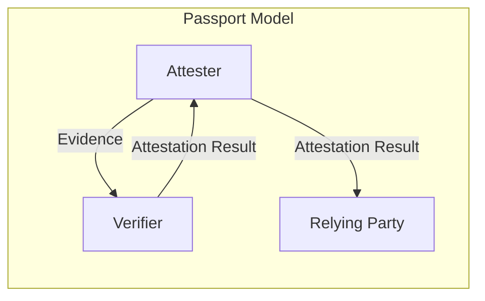
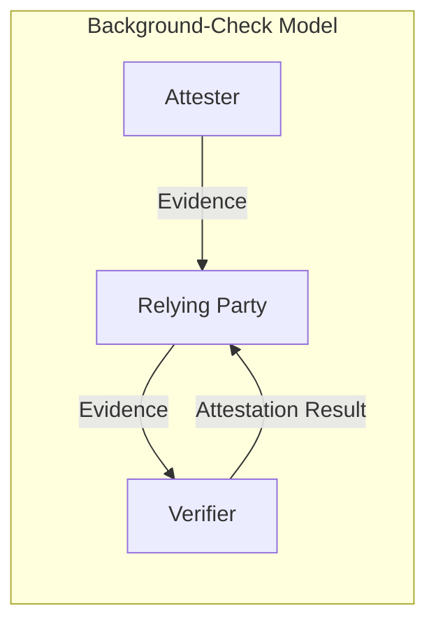
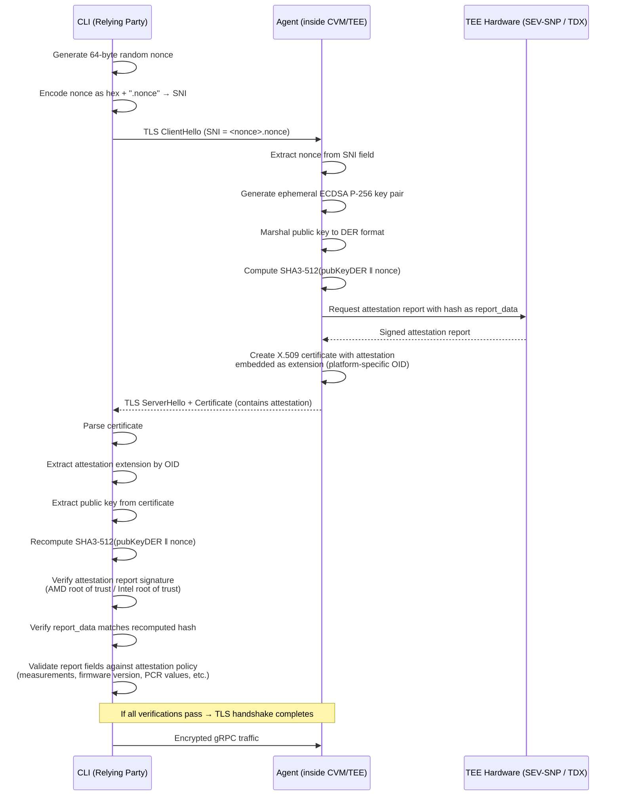
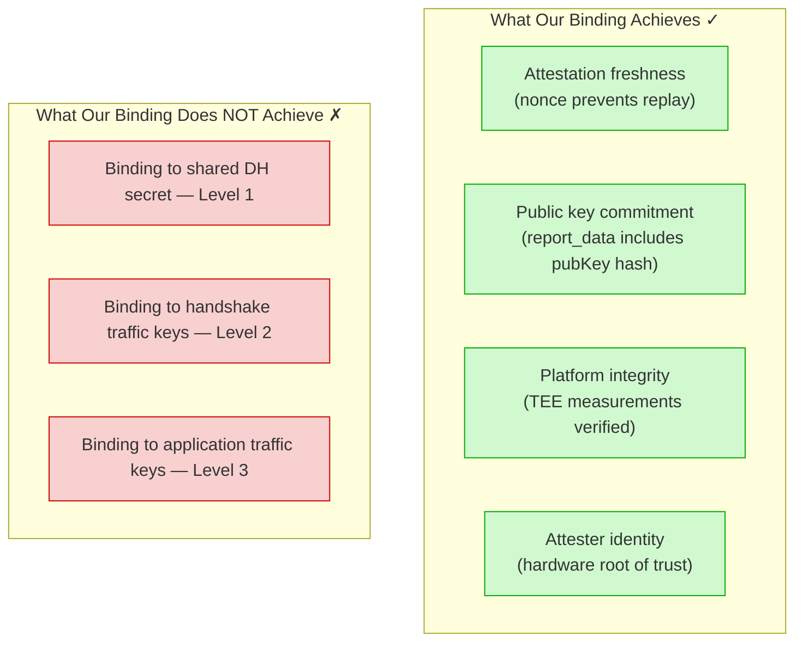
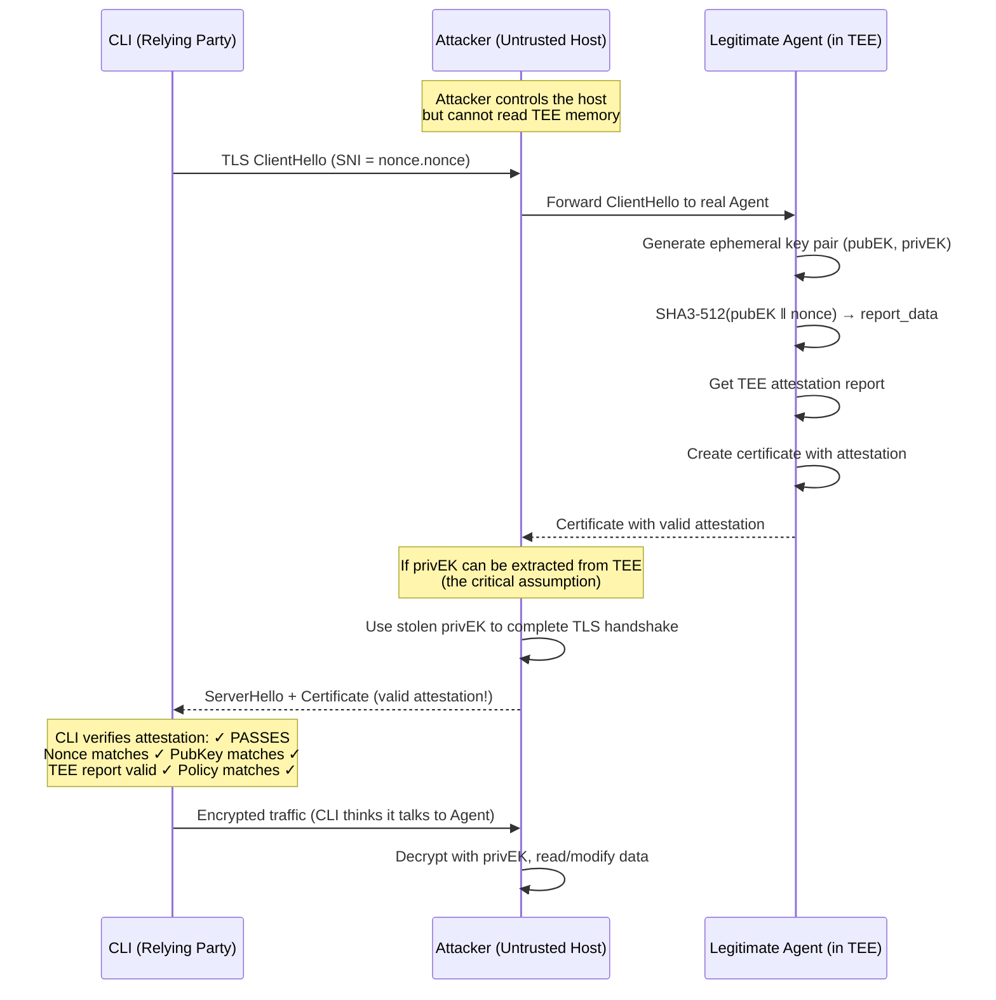

## Introduction

Cocos AI is a platform that leverages Confidential Computing and Trusted Execution Environments (TEEs) to enable secure multiparty computation (SMPC). Within its architecture, the Agent operates inside a Confidential VM (CVM) — powered by AMD SEV-SNP or Intel TDX — and establishes an attested TLS (aTLS) connection with the CLI to provide both encrypted communication and runtime integrity guarantees.

In January 2026, Dr. Muhammad Usama Sardar (TU Dresden), Dr. Viacheslav Dubeyko (IBM), and Prof. Jean-Marie Jacquet (University of Namur) [presented findings to the IETF SEAT working group](https://mailarchive.ietf.org/arch/msg/seat/x3eQxFjQFJLceae6l4_NgXnmsDY/) demonstrating that **all** current intra-handshake attested TLS implementations — including Cocos AI, Meta's Private Processing, Edgeless Systems Contrast, and the CCC proof-of-concept — are vulnerable to relay attacks. Their formal analysis, conducted using [ProVerif](https://bblanche.gitlabpages.inria.fr/proverif/), proved that none of these implementations achieve even the weakest level of binding between the attestation evidence and the TLS connection itself.

This post is our technical response. We explain exactly how Cocos AI's aTLS works today, we acknowledge the limitations that the formal analysis exposed, we analyze the gap between our current binding mechanism and the state of the art, and we lay out our plan to address these shortcomings.

## Background: RATS and Attested TLS

### The RATS Architecture

Remote ATtestation procedureS ([RFC 9334](https://datatracker.ietf.org/doc/rfc9334/)) define a standardized framework for proving the trustworthiness of a remote system. The key roles are:

- **Attester**: The entity (e.g., a TEE) that generates **Evidence** about its operational state — firmware hashes, kernel measurements, PCR values.
- **Verifier**: Evaluates Evidence against **Reference Values** and **Endorsements** (e.g., AMD root certificates) to produce an **Attestation Result**.
- **Relying Party**: Consumes the Attestation Result to make trust decisions (e.g., "should I send my data to this CVM?").

RATS defines two topological models for how these roles interact:





Cocos AI uses the **background-check model**: the Agent (Attester) sends Evidence directly to the CLI (Relying Party), and the CLI performs verification locally using reference values from an attestation policy file.

### What Is Attested TLS?

Attested TLS (aTLS) enriches a standard TLS handshake with attestation evidence. The goal is to let a client verify not just the identity of the server (as in standard TLS), but also the **integrity and runtime state** of the execution environment the server runs in. For Confidential Computing, this means proving the server is running inside a genuine TEE with the expected firmware, kernel, and application measurements.

The specific variant Cocos AI implements is **intra-handshake attestation**: the attestation evidence is embedded into the TLS handshake itself (inside the X.509 certificate), rather than exchanged in a separate protocol step.

## How Cocos AI aTLS Works Today

### Architecture Overview


The Agent runs inside a CVM (Confidential VM) protected by hardware-level memory encryption and isolation (AMD SEV-SNP or Intel TDX). A new TLS connection is established every time a command is issued via the Cocos AI CLI. Each connection generates a fresh ephemeral key pair and a fresh attestation report — there is no certificate reuse.

### The Handshake Flow

The complete aTLS handshake flow is illustrated below:


And here is the detailed sequence of operations:



Let's walk through each stage in detail.

### Step 1: Nonce Generation and Delivery via SNI

The CLI generates a cryptographically random 64-byte nonce and encodes it into the TLS Server Name Indication (SNI) extension:

```go
nonce := make([]byte, 64)
if _, err := rand.Read(nonce); err != nil {
    return nil, errors.Wrap(errors.New("failed to generate nonce"), err)
}

encoded := hex.EncodeToString(nonce)
sni := encoded + ".nonce"
```

The SNI is used because the CVM runs a single service (the Agent), so the standard hostname-routing purpose of SNI is unnecessary. We acknowledge that this is a non-standard use of the SNI field — a point we return to in the [Limitations](#limitations-and-the-relay-attack) section.

### Step 2: Ephemeral Key Generation

On receiving the `ClientHello`, the Agent generates a fresh ECDSA P-256 key pair. A new key pair is generated **for every connection**, regardless of whether the same CLI user is reconnecting:

```go
func (p *attestedCertificateProvider) GetCertificate(
    clientHello *tls.ClientHelloInfo,
) (*tls.Certificate, error) {
    privateKey, err := ecdsa.GenerateKey(elliptic.P256(), rand.Reader)
    if err != nil {
        return nil, fmt.Errorf("failed to generate private key: %w", err)
    }

    pubKeyDER, err := x509.MarshalPKIXPublicKey(&privateKey.PublicKey)
    if err != nil {
        return nil, fmt.Errorf("failed to marshal public key: %w", err)
    }

    nonce, err := extractNonceFromSNI(clientHello.ServerName)
    // ...
```

### Step 3: Attestation Report Generation

The Agent computes `SHA3-512(pubKeyDER ‖ nonce)` and requests an attestation report from the TEE hardware. The hash is placed in the `report_data` field of the attestation report, binding the report to both the certificate's public key and the client's challenge nonce:

```go
func (p *platformAttestationProvider) Attest(
    pubKey []byte, nonce []byte,
) ([]byte, error) {
    teeNonce := append(pubKey, nonce...)
    hashNonce := sha3.Sum512(teeNonce)
    return p.provider.Attestation(hashNonce[:], hashNonce[:32])
}
```

For AMD SEV-SNP, the `Attestation()` call results in a hardware-signed report via the SEV guest firmware, with the certificate chain (VCEK → ASK → ARK) fetched from AMD's Key Distribution Service. For Intel TDX, it produces a TDX Quote signed by the platform's quoting enclave. The critical property is that the `report_data` field is included in the signed portion of the report and cannot be tampered with.

### Step 4: Certificate Creation with Attestation Extension

The attestation report is embedded into the X.509 certificate as a custom extension identified by a platform-specific OID:

| Platform       | OID              |
|:---------------|:-----------------|
| SEV-SNP + TPM | `2.99999.1.0`    |
| Azure CVM      | `2.99999.1.1`    |
| Intel TDX      | `2.99999.1.2`    |

```go
extension := pkix.Extension{
    Id:    p.attestationProvider.OID(),
    Value: attestationData,
}
```

The certificate can be either self-signed or CA-signed (via an external certificate authority service). In CA-signed mode, a CSR is generated with the attestation extension and submitted to the CA:

```go
csrMetadata := certs.CSRMetadata{
    Organization:    []string{p.subject.Organization},
    Country:         []string{p.subject.Country},
    CommonName:      p.subject.CommonName,
    Province:        []string{p.subject.Province},
    Locality:        []string{p.subject.Locality},
    StreetAddress:   []string{p.subject.StreetAddress},
    PostalCode:      []string{p.subject.PostalCode},
    ExtraExtensions: []pkix.Extension{extension},
}

csr, sdkerr := p.certsSDK.CreateCSR(csrMetadata, privateKey)
if sdkerr != nil {
    return nil, fmt.Errorf("failed to create CSR: %w", sdkerr)
}

cert, err := p.certsSDK.IssueFromCSRInternal(
    p.cvmID, p.ttl.String(), string(csr.CSR), p.agentToken,
)
```

### Step 5: Client-Side Verification

On the CLI side, standard TLS certificate verification is **intentionally skipped** (`InsecureSkipVerify: true`) because the attestation-embedded certificate is self-signed or signed by a private CA. Instead, a custom `VerifyPeerCertificate` callback performs the actual verification:

```go
tlsConfig := &tls.Config{
    InsecureSkipVerify: true,
    RootCAs:            rootCAs,
    ServerName:         sni,
    VerifyPeerCertificate: func(rawCerts [][]byte,
        verifiedChains [][]*x509.Certificate) error {
        return atls.NewCertificateVerifier(rootCAs).
            VerifyPeerCertificate(rawCerts, verifiedChains, nonce)
    },
}
```

The verification logic performs three checks:

**1. Certificate signature verification** — either self-trust (the cert is added to its own root pool) or CA chain validation:

```go
func (v *certificateVerifier) verifyCertificateSignature(
    cert *x509.Certificate,
) error {
    rootCAs := v.rootCAs
    if rootCAs == nil {
        rootCAs = x509.NewCertPool()
        rootCAs.AddCert(cert) // Self-signed: trust the cert itself
    }
    opts := x509.VerifyOptions{
        Roots:       rootCAs,
        CurrentTime: time.Now(),
    }
    _, err := cert.Verify(opts)
    return err
}
```

**2. Attestation extension extraction** — the verifier iterates over the certificate's extensions, matches the OID to a platform type, and extracts the attestation data.

**3. Attestation report verification** — the verifier recomputes the same `SHA3-512(pubKeyDER ‖ nonce)` hash and verifies it matches the `report_data` in the attestation report. It also validates the report's cryptographic signature against the hardware vendor's root of trust (AMD ARK/ASK chain or Intel's root), and checks all report fields against the user-supplied attestation policy:

```go
func (v *certificateVerifier) verifyCertificateExtension(
    extension []byte, pubKey []byte, nonce []byte,
    platformType attestation.PlatformType,
) error {
    verifier, err := platformVerifier(platformType)
    if err != nil {
        return fmt.Errorf("failed to get platform verifier: %w", err)
    }

    teeNonce := append(pubKey, nonce...)
    hashNonce := sha3.Sum512(teeNonce)

    if err = verifier.VerifyAttestation(
        extension, hashNonce[:], hashNonce[:32],
    ); err != nil {
        return fmt.Errorf("failed to verify attestation: %w", err)
    }
    return nil
}
```

### What the Attestation Policy Validates

The attestation policy is a JSON file that the relying party uses to enforce expectations about the CVM's state. It covers:

- **TPM PCR values** (SHA-256 and SHA-384): golden measurements for each PCR register, covering firmware, bootloader, kernel, and initrd.
- **SEV-SNP report fields**: chip ID, family ID, image ID, launch measurement, minimum TCB/build versions, VMPL level, guest policy flags.
- **Root of trust**: AMD product line, CRL checking configuration.

This policy-based approach allows each relying party to independently define what constitutes a trustworthy CVM state, rather than deferring to a centralized verifier.

### Mutual Authentication

Cocos AI supports mutual attested TLS (maTLS), where the Agent also verifies the CLI's certificate. When enabled, only computation members whose public keys are registered in the computation manifest can establish connections. The Agent uses gRPC-level authentication to verify request signatures (RSA, ECDSA, or Ed25519) against the registered member keys, ensuring role-based access control (data providers, algorithm providers, consumers).

## Binding Mechanism Analysis

Our binding mechanism is: **`SHA3-512(pubKeyDER ‖ nonce)`** placed in the attestation report's `report_data` field.

Using the taxonomy from Sardar et al., this corresponds to binding mechanism **B.2** — `Hash(Client's Attestation nonce ‖ Server's public key)`.

Here is what this binding achieves and what it does not:



The critical gap: **there is no cryptographic binding between the attestation evidence and the TLS session**. The attestation proves that a legitimate TEE generated a specific public key, but it does not prove that this public key is the one actually used in the Diffie-Hellman key exchange that establishes the TLS session keys.

## Limitations and the Relay Attack

### The Formal Analysis

Sardar et al. analyzed all known intra-handshake attestation implementations using [ProVerif](https://bblanche.gitlabpages.inria.fr/proverif/), a symbolic security analysis tool. Their key findings, presented at [IETF SEAT meeting 124](https://mailarchive.ietf.org/arch/msg/seat/x3eQxFjQFJLceae6l4_NgXnmsDY/) and documented in [draft-usama-seat-intra-vs-post](https://datatracker.ietf.org/doc/draft-usama-seat-intra-vs-post/):

1. **All** analyzed binding mechanisms fail to achieve even Level 1 binding (correlation of Evidence to the shared DH secret).
2. Any binding that involves the server's public key requires the **additional assumption** that the server's private key does not leak.
3. The extension of TLS with attestation in these implementations does not bring the security benefit one might expect from a purely theoretical perspective.

### The Relay Attack Scenario

Here is the concrete attack that the formal analysis proves is possible:



The attack relies on the adversary being able to extract the Agent's ephemeral private key (`privEK`). While TEEs are specifically designed to prevent this, the formal analysis correctly points out that our protocol's security **reduces entirely** to this single assumption. The TLS attestation extension does not add a separate layer of binding — if the key leaks, the attestation provides no additional protection.

### Why This Matters

This is not merely a theoretical concern. TEE key extraction has been demonstrated in practice:

- **Side-channel attacks** on AMD SEV (e.g., [SEVered](https://arxiv.org/abs/1805.09604)) have shown that host-level attackers can sometimes extract secrets from TEE memory under specific conditions.
- **TEE vulnerability research** datasets such as [TEE.fail](https://tee.fail/) document a wide range of attacks across different hardware implementations.
- **Firmware vulnerabilities** in TEE implementations could potentially expose in-memory keys to the host.

If the private key never leaves the TEE, our protocol is secure. But a defense-in-depth approach should not stake everything on a single assumption.

### Implementation-Specific Issues

Beyond the fundamental binding gap, the IETF analysis flagged two implementation-level concerns specific to Cocos AI:

1. **SNI abuse**: We use the TLS Server Name Indication extension to carry the attestation nonce. SNI was designed for virtual hosting (routing requests to the correct server based on hostname). Using it to carry a 64-byte hex-encoded nonce is non-standard. While it works — the CVM runs only the Agent, so hostname routing is unnecessary — it could cause issues with middleboxes, TLS-intercepting proxies, or future TLS implementations that validate SNI format. The [draft-fossati-seat-expat](https://datatracker.ietf.org/doc/draft-fossati-seat-expat/) proposal (EXPAT) defines a proper mechanism for transporting evidence and expected evidence using exported authenticators, which would be a more robust alternative to our current intra-handshake approach. Alternatively, [draft-fossati-seat-early-attestation](https://datatracker.ietf.org/doc/draft-fossati-seat-early-attestation/) defines a proper TLS extension for attestation evidence during the initial handshake, which would also be a more standard mechanism than SNI abuse.

2. **`InsecureSkipVerify: true`**: We disable Go's built-in certificate verification and rely entirely on our custom callback. While this is necessary for self-signed attested certificates, it means any bug in our custom verification logic would leave the connection completely unverified. CA-signed mode partially mitigates this since the CA chain provides an additional trust anchor.

## State of the Art and Comparison

The table below summarizes how Cocos AI compares to other implementations analyzed by Sardar et al.:

| Implementation | Binding Mechanism | Platform | Nonce Delivery | Vulnerable to Relay? |
|:---|:---|:---|:---|:---|
| **Cocos AI** | `SHA3-512(pubKey ‖ attestation_nonce)` | SEV-SNP, TDX | SNI extension | Yes |
| **Meta Private Processing** | Client's TLS nonce in report_data | SEV-SNP | TLS nonce (no separate attestation nonce) | Yes (also lacks freshness) |
| **Edgeless Contrast** | `Hash(attestation_nonce ‖ pubKey)` | Intel TDX | ALPN extension | Yes |
| **CCC PoC** | Per draft-fossati-seat-early-attestation | Various | TLS extension | Yes |
| **Proposed Mitigation (Sardar et al.)** | Cryptographic binder in CertificateVerify | Any | TLS extension | Achieves Level 2 |

Notable: Meta's implementation was audited by Trail of Bits, who did not find the relay attack. As Sardar et al. note, no formal methods were used in that review, underscoring the value of symbolic analysis tools like ProVerif.

### Binding Levels Explained

The formal analysis defines three levels of binding strength:

- **Level 1 — Shared DH Secret (`g^xy`)**: The attestation evidence is correlated to the shared Diffie-Hellman secret negotiated during the TLS handshake. This means a relay attacker cannot reuse the attestation in a different TLS session.
- **Level 2 — Client's Handshake Traffic Key (`htsc`)**: The evidence is correlated to the client's handshake traffic key, which is derived from the shared DH secret and the handshake transcript. This is strictly stronger than Level 1.
- **Level 3 — Client's Application Traffic Key (`atsc`)**: The evidence is correlated to the client's application traffic key. This is the strongest level but is believed to be unachievable within intra-handshake attestation.

Sardar et al. proved the implication chain: **G3 ⇒ G2 ⇒ G1**.

All current implementations, including Cocos AI, fail to achieve **any** of these levels. The proposed mitigation — a cryptographic binder modifying the `CertificateVerify` message — would achieve Level 2.

## Our Roadmap

We take these findings seriously and are committed to improving the security guarantees of Cocos AI's aTLS implementation. Here is our plan:

### Short-Term Mitigations

1. **Adopt a dedicated TLS extension for nonce delivery**: Replace the SNI-based nonce mechanism with a proper TLS extension, aligning with [draft-fossati-seat-early-attestation](https://datatracker.ietf.org/doc/draft-fossati-seat-early-attestation/) as it matures. This eliminates the "SNI abuse" concern and improves interoperability.

2. **Strengthen TEE key protection**: Ensure ephemeral private keys are generated and used entirely within the TEE boundary, with explicit memory barriers preventing key material from being paged out. Leverage hardware-bound key storage where available (e.g., TPM-based key sealing).

3. **Comprehensive CI/CD attestation testing**: Expand our test suite to verify the full attestation chain under adversarial conditions, including malformed nonces, expired reports, and tampered extensions.

### Medium-Term: Achieving Level 2 Binding

4. **Implement the CertificateVerify-based binder**: Adopt the mitigation proposed by Sardar et al. — a cryptographic binder in the `CertificateVerify` message that ties the attestation evidence to the TLS handshake transcript. This would achieve Level 2 binding (correlation to client's handshake traffic key), closing the relay attack vector.

5. **Contribute to IETF standardization**: Actively participate in the SEAT working group to help standardize the binding mechanism, ensuring interoperability across implementations.

### Long-Term

6. **Explore post-handshake attestation**: Investigate whether post-handshake attestation (exchanging evidence after the TLS channel is established) can provide stronger guarantees, potentially achieving Level 3 binding. While this changes the protocol's security model (the first bytes of application data would flow before attestation completes), it eliminates the intra-handshake binding problem entirely.

7. **Formal verification of our implementation**: Conduct our own formal analysis using ProVerif or Tamarin to verify any new binding mechanism before deployment.

## What Remains Strong

Despite the relay attack limitation, our current implementation provides meaningful security guarantees that should not be dismissed:

- **Platform integrity verification**: The attestation policy validates firmware versions, kernel measurements, PCR values, and TCB levels. An attacker cannot forge a valid attestation report without access to the TEE hardware attestation key, which is burned into the processor at manufacture.
- **Ephemeral key rotation**: Every connection uses a fresh key pair and a fresh attestation report, limiting the window for any attack.
- **Hardware root of trust**: Attestation reports are signed by keys rooted in AMD or Intel's hardware trust chain. Forging a report requires breaking the hardware vendor's signing infrastructure.
- **Mutual authentication**: When mutual aTLS is enabled, both sides verify each other's identity, and the Agent enforces role-based access control on every gRPC request.
- **Defense in depth**: TEE memory isolation is the primary defense against key extraction. The relay attack requires breaking this isolation first — a non-trivial feat against current-generation hardware when properly configured.

The relay attack is a real concern, but it requires a sophisticated adversary who can both compromise the TEE's memory isolation **and** intercept the network connection. For many threat models, the current guarantees remain valuable.

## Conclusion

Attested TLS is a powerful concept, but the formal analysis by Sardar et al. demonstrates that the current generation of implementations — ours included — have a fundamental gap: the attestation evidence is not cryptographically bound to the TLS session. This means the security of these implementations reduces to the assumption that the TEE's memory isolation is perfect.

We believe transparency about these limitations is essential. Cocos AI's aTLS implementation provides strong attestation and ephemeral key management within the constraints of the current approach, but it does not yet achieve the binding guarantees that a formally verified protocol would provide.

We are actively working on adopting the cryptographic binder proposed by the SEAT working group, which would achieve Level 2 binding and close the relay attack vector. We will also contribute to the ongoing IETF standardization efforts to ensure that the entire ecosystem converges on a secure, interoperable solution.

In the meantime, we encourage all users of Confidential Computing platforms to:

1. Keep TEE firmware and microcode up to date to minimize the risk of key extraction.
2. Use mutual aTLS with CA-signed certificates where possible.
3. Define strict attestation policies that validate all available report fields.
4. Monitor the IETF SEAT and UFMRG working groups for updates on standardized attested TLS protocols.

The path forward is clear: stronger binding, formal verification, and community collaboration. We are committed to getting there.
