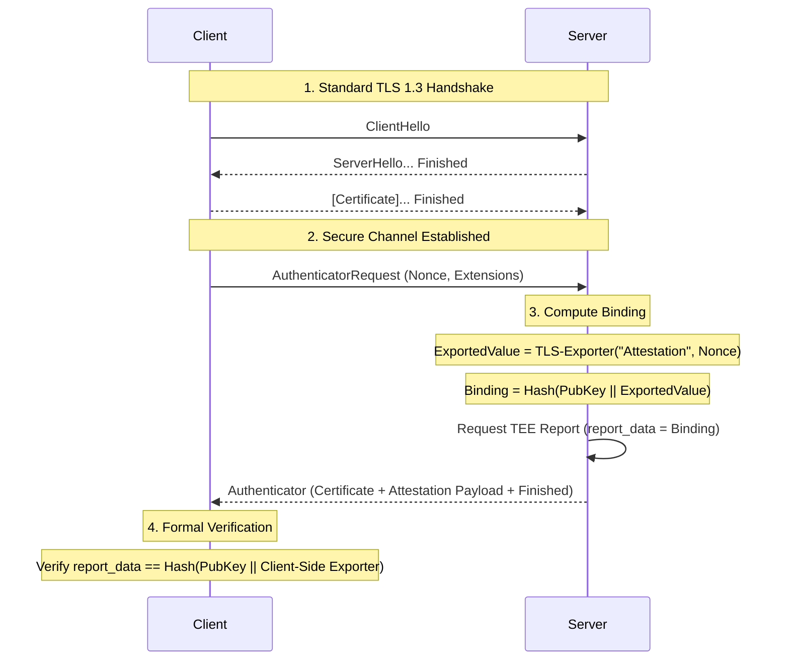

## Introduction

In our [last technical blog post](https://www.ultraviolet.rs/blog/tee-tls-privacy/), we analyzed the "Identity Crisis" in Confidential Computing — a fundamental binding gap in intra-handshake attested TLS (aTLS) protocols. We discussed how Cocos AI, along with industry peers, was susceptible to **relay attacks** because the attestation evidence was tied to the server's public key but not to the unique TLS session itself.

Today, we are thrilled to announce that we have fulfilled our roadmap. With [PR #582](https://github.com/ultravioletrs/cocos/pull/582), Cocos AI has transitioned to a new aTLS architecture that achieves **Level 2 binding**, formally mitigating [GHSA-vfgg-mvxx-mgg7](https://github.com/ultravioletrs/cocos/security/advisories/GHSA-vfgg-mvxx-mgg7).

## The Recap: Why Level 0 Wasn't Enough

The previous vulnerability (and the class of attacks identified by Sardar et al. using ProVerif) stemmed from the fact that an attacker who could extract a TEE's ephemeral private key — even momentarily — could relay that TEE's attestation report to a different connection.

In the old design:
1. Evidence tied to `Hash(ServerPubKey ‖ Nonce)`.
2. Nonce delivered via SNI (a non-standard hack).
3. Verification happened in a custom callback that "bolted on" trust.

If the private key leaked, the "binding" to the public key was effectively useless against a relay attacker who controlled the host.

## The Achievement: Level 2 Session Binding

The gold standard for aTLS, as defined by the IETF SEAT (Secure Evidence ATtestation) working group, is for the evidence to be cryptographically bound to the handshake transcript or the traffic keys.

Cocos AI now achieves this through three major architectural shifts:

### 1. Exclusive TLS 1.3
We have dropped support for older TLS versions in our aTLS paths. TLS 1.3 provides a cleaner handshake and superior key derivation functions (HKDF) which are essential for robust session export.

### 2. TLS Exporters & Nonce Freshness (RFC 5705)
A common misconception is that session binding replaces the need for a nonce. In the new Cocos aTLS flow (based on the [IETF EXPAT draft](https://datatracker.ietf.org/doc/draft-fossati-seat-expat/)), the nonce provided by the CLI is now carried within the `certificate_request_context`.

This context is then used as the `context_value` for the TLS Exporter, ensuring that the derived value is both fresh (non-repeating) and cryptographically bound to the session:

```go
// From pkg/atls/eaattestation/binding.go
func ComputeBinding(st *tls.ConnectionState, label string, contextValue []byte, leaf *x509.Certificate) (exportedValue, aikPubHash, binding []byte, err error) {
    // contextValue here contains the Verifier-provided nonce
    exportedValue, h, err := ExportAttestationValue(st, label, contextValue)
    // ...
    pub, _ := PublicKeyBytes(leaf)
    binding = Hash(h, pub, exportedValue)
    return exportedValue, aikPubHash, binding, nil
}
```

The binding value, which serves as the final attestation challenge, is defined as:
$$\text{Binding} = \text{Hash}(\text{PublicKey} \parallel \text{TLS-Exporter}(\text{Label, Nonce}))$$

### 3. Level 2 Binding Logic
By including this TLS-exported binder in the attestation's `report_data`, we achieve **Level 2 Binding** (Correlation to Handshake Traffic Keys). This ensures that the evidence is fundamentally bound to the cryptographic state of the *specific* TLS session.



Even if an adversary manages to extract the ephemeral private key, they **cannot relay the attestation**. The evidence is now mathematically part of the TLS session. To relay it, they would need to break the underlying TLS 1.3 key exchange itself.

## Cleaning Up: No More SNI Hacks

Standardization and protocol hygiene were also key goals. The previous use of the SNI (Server Name Indication) field to transport nonces was a pragmatic but fragile hack.

The new implementation moves away from SNI abuse. Instead, it utilizes a sophisticated frame-based protocol over the TLS connection or **Exported Authenticators** (RFC 9162). This allows for a clean separation of concerns:
- **TLS** handles the secure channel.
- **Exported Authenticators** handle the platform identity and evidence exchange.

## Addressing the "Identity Crisis" (GHSA-vfgg-mvxx-mgg7)

The technical overhaul in Cocos AI v0.9.0 directly mitigates [GHSA-vfgg-mvxx-mgg7](https://github.com/ultravioletrs/cocos/security/advisories/GHSA-vfgg-mvxx-mgg7), a high-severity vulnerability that affected nearly all previous versions (v0.4.0 through v0.8.2).

As detailed in the advisory, the flaw was architectural: by binding attestation evidence only to the server's ephemeral public key—and not the TLS channel itself—the protocol remained vulnerable to relay attacks. An adversary capable of extracting the ephemeral private key (e.g., via side-channel or physical access) could divert an attested TLS session, leading the client to accept a connection with a malicious relay under the false assumption of TEE integrity.

By implementing **Level 2 binding** with TLS 1.3 Exporters, we have fundamentally closed this vector. The attestation evidence is now cryptographically tied to the unique handshake transcript and session keys of the specific connection. Even in a hypothetical scenario where a private key leaks, the stolen evidence cannot be relayed to a different session; it is mathematically anchored to the secure channel it was generated for.

## Path Forward

While we have achieved Level 2 binding — which is the practical "state of the art" for intra-handshake attestation — our research doesn't stop here. We are continuing to track the IETF SEAT working group's progress on standardized aTLS extensions and are investigating post-handshake attestation models (Level 3) for scenarios requiring even tighter integration between application data and platform trust.

We would like to thank the research team at TU Dresden and the IETF community for their rigorous formal analysis that helped us harden Cocos AI.

## Conclusion

Cocos AI is now more than just "attested." It is **formally bound**. By migrating to a TLS 1.3 Exporter-based design, we have eliminated a significant class of relay attacks and moved our protocol into alignment with emerging internet standards.

Upgrade your CLI and Agent to the latest version (v0.9.0+) to take advantage of these security enhancements.

---
*For more technical details, check out the [Cocos repository](https://github.com/ultravioletrs/cocos) and the [new aTLS implementation](https://github.com/ultravioletrs/cocos/tree/main/pkg/atls).*
