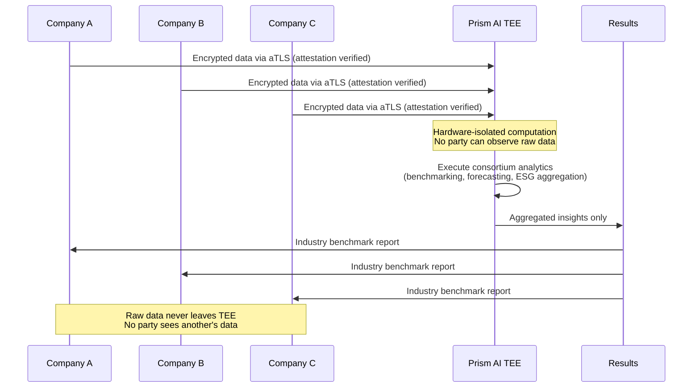

In a hyperconnected global economy, the most valuable business insights are rarely produced in isolation. Industry benchmarking, supply chain optimization, market intelligence, and sustainability reporting all demand data from multiple organizations—often competitors operating under the same market pressures. Yet the very act of sharing proprietary data introduces existential risk: exposure of trade secrets, violation of antitrust statutes, and catastrophic erosion of competitive position.

Today, enterprises face a structural paradox. The collective intelligence embedded in distributed corporate datasets is exponentially more valuable than any single company's data in isolation, but no rational enterprise will expose its proprietary information to a competitor, a consortium orchestrator, or even a trusted third party. The result is an industry-wide deadlock: trillions of dollars in latent analytical value remain locked inside corporate data silos while executives make strategic decisions based on incomplete, fragmented market views.

Prism AI resolves this paradox by enabling **consortium-style data collaboration**—analogous to a Kaggle competition for enterprises—where companies contribute proprietary datasets to joint analytical workloads without ever exposing raw data to any other party. Through the synthesis of **Trusted Execution Environments (TEEs)**, **Attested TLS (aTLS)**, and **secure multi-party computation (MPC)**, Prism AI provides cryptographic guarantees that each participant's data remains confidential throughout the entire computational lifecycle.

## The Enterprise Data Collaboration Challenge

### The Cost of Data Isolation

McKinsey estimates that cross-company data collaboration could unlock **$3 trillion** in annual economic value across industries. Yet fewer than 12% of enterprises have successfully operationalized inter-organizational analytics programs. The reasons are systemic:

- **Competitive sensitivity:** Sharing sales figures, pricing strategies, or operational metrics risks revealing strategic positioning to rivals.
- **Regulatory exposure:** Industries such as energy, telecommunications, and financial services operate under strict antitrust regimes. Even anonymized data exchanges between competitors can trigger regulatory scrutiny under the Sherman Act, the EU Competition Law, or the UK Competition Act 1998.
- **Technical friction:** Establishing data clean rooms, negotiating bilateral Data Processing Agreements (DPAs), and reconciling disparate data schemas can consume 12–18 months of engineering and legal effort per partnership.
- **Trust deficits:** No enterprise fully trusts a third-party intermediary—not a cloud provider, not a consulting firm, not even an industry association—to handle its most sensitive operational data.

### Why Traditional Approaches Fail

| Approach | Mechanism | Critical Weakness |
|---|---|---|
| **Data Clean Rooms** | Aggregated queries in a neutral environment | The clean room operator can observe raw data; limited query flexibility |
| **Anonymization / k-Anonymity** | Strip or generalize identifiers | Linkage attacks can re-identify records, especially in small industry cohorts |
| **Trusted Third Parties** | A neutral intermediary holds all data | Single point of failure; the intermediary sees everything |
| **Bilateral Data Sharing** | Direct exchange under NDA | Does not scale beyond two parties; legal complexity grows combinatorially |
| **Synthetic Data** | Generate artificial datasets from real distributions | Cannot capture rare events or tail distributions critical for competitive analysis |

Each of these approaches introduces a **trust assumption** that rational enterprises refuse to accept when their most valuable intellectual property is at stake.

## Prism AI: Secure Multi-Party Analytics Architecture

Prism AI eliminates trust assumptions entirely through a hardware-enforced, cryptographically verified computational architecture.

### Attested TLS (aTLS): Verifiable Secure Channels

Before any data leaves a participant's infrastructure, Prism AI establishes **Attested TLS (aTLS)** connections. Unlike standard TLS, which only verifies the identity of the server, aTLS extends the handshake to include a **remote attestation report** generated by the TEE hardware itself:

1. **Hardware Attestation:** The TEE (AMD SEV-SNP or Intel TDX) generates a cryptographic attestation report proving the exact firmware version, security configuration, and code hash running inside the enclave.
2. **Certificate Binding:** The attestation report is cryptographically bound to the TLS certificate, ensuring the connection terminates exclusively inside a verified, tamper-proof enclave.
3. **Mutual Verification:** Each participating enterprise independently verifies the attestation before transmitting any data, eliminating the need to trust the platform operator.

This means that even if the network infrastructure, the cloud provider, or the Prism AI platform operator itself were compromised, the data in transit and at rest inside the TEE remains cryptographically inaccessible.

### Secure Multi-Party Computation (MPC)

For analytical workloads where even encrypted inputs to a single TEE represent an unacceptable trust concentration, Prism AI supports **secure multi-party computation** protocols:

- **Secret Sharing:** Each participant's dataset is split into cryptographic shares distributed across multiple TEE nodes. No single node possesses sufficient information to reconstruct any participant's raw data.
- **Garbled Circuits:** Complex analytical functions (regression, classification, aggregation) are compiled into encrypted circuits that compute over encrypted inputs, producing only the agreed-upon output.
- **Threshold Decryption:** Results are only decryptable when a configurable quorum of participants (e.g., 3-of-5 consortium members) agree to release the output.

### End-to-End Workflow

## Industry Benchmarking: Compete on Insights, Not on Exposure

### The Problem

Companies in the same industry desperately need to understand how their performance compares to peers. Retailers want to benchmark same-store sales growth. Manufacturers want to compare production efficiency. Energy companies want to benchmark carbon intensity per megawatt-hour. But sharing these metrics directly would reveal proprietary operational details to competitors.

### How Prism AI Solves It

Consider a consortium of **five major European automotive manufacturers** seeking to benchmark electric vehicle (EV) battery production efficiency. Each manufacturer possesses proprietary data on:

- Cell-level defect rates per production line
- Energy consumption per kWh of battery capacity produced
- Raw material yield ratios (lithium, cobalt, nickel)
- Time-to-quality metrics for new battery chemistries

Using Prism AI, each manufacturer encrypts its production dataset and transmits it via aTLS to a verified TEE enclave. Inside the enclave, a pre-audited benchmarking algorithm computes:

- **Industry-wide percentile rankings** (e.g., "Your defect rate places you in the 72nd percentile")
- **Anonymized distribution curves** showing where the industry clusters
- **Gap analysis** identifying specific operational areas where a participant lags behind the median

Each manufacturer receives only its own percentile position relative to the anonymized aggregate. No manufacturer can determine any other's absolute values, production volumes, or supplier relationships.

**Real-world parallel:** The Manufacturers Alliance (MAPI) and the European Automobile Manufacturers' Association (ACEA) have long attempted voluntary benchmarking programs but have been hampered by limited participation due to data sensitivity. Prism AI removes the trust barrier entirely.

### Measurable ROI

- **Participation rates:** Confidential benchmarking programs see **3–5× higher participation** than voluntary disclosure programs.
- **Operational improvement:** Companies that benchmark against industry peers achieve **8–15% faster performance improvement** than those relying solely on internal metrics (Boston Consulting Group, 2024).
- **Time savings:** From 12–18 months of legal negotiation to **days** of technical onboarding.

## Supply Chain Optimization: Collaborative Forecasting Without Exposure

### The Problem

Modern supply chains span dozens of organizations across multiple tiers. Demand signals, inventory levels, logistics costs, and production schedules are distributed across suppliers, manufacturers, distributors, and retailers. Optimizing the end-to-end supply chain requires visibility across all tiers—but no participant will share its proprietary demand forecasts, margin structures, or supplier relationships.

The **bullwhip effect**—where small demand fluctuations at the retail level amplify into massive inventory swings upstream—costs global supply chains an estimated **$400 billion annually** in excess inventory, stockouts, and expedited shipping.

### How Prism AI Solves It

A retail consortium (e.g., major grocery chains collaborating on demand forecasting for perishable goods) deploys a federated forecasting model through Prism AI:

1. **Each retailer** encrypts its point-of-sale (POS) data, regional weather correlations, and promotional calendars.
2. **Each supplier** encrypts its production capacity, lead times, and raw material availability.
3. **Inside the TEE**, a demand forecasting model (e.g., a temporal fusion transformer) trains on the combined dataset, learning cross-chain demand patterns invisible to any single participant.
4. **Each participant receives** only demand forecasts relevant to their own operations—retailers get replenishment recommendations; suppliers get production planning signals.

No retailer sees another's sales data. No supplier sees another's capacity constraints. The collective forecast is dramatically more accurate than any individual forecast.

### Quantified Impact

| Metric | Single-Company Forecast | Prism AI Consortium Forecast |
|---|---|---|
| **Demand Forecast Accuracy (MAPE)** | 22–35% | 8–14% |
| **Inventory Carrying Cost Reduction** | Baseline | 15–25% reduction |
| **Stockout Rate** | 5–8% | 1–3% |
| **Food Waste (Perishable Goods)** | 12–15% | 4–7% |

## Consortium Analytics: Joint Intelligence Without Antitrust Risk

### The Antitrust Challenge

When competitors collaborate on data analytics, they face a minefield of antitrust regulation. Under the Sherman Act (US), Article 101 TFEU (EU), and analogous global competition laws, the exchange of competitively sensitive information—pricing, production volumes, market strategies—can constitute illegal collusion, even when the intent is purely analytical.

The critical legal distinction is between sharing **raw, disaggregated, competitively sensitive data** (potentially illegal) and sharing **aggregated, anonymized, historical insights** (generally permissible). Traditional data clean rooms blur this line because the clean room operator can observe individual-level data.

### How Prism AI Eliminates Antitrust Exposure

Prism AI's TEE architecture provides a legally defensible separation:

- **No human observer**—including the Prism AI platform operator—can access any participant's raw data inside the TEE.
- **Cryptographic attestation** provides an auditable, mathematically verifiable proof that only the pre-approved analytical algorithm executed over the data.
- **Output validation:** The consortium pre-defines the permissible output schema (e.g., "industry median ± standard deviation, minimum five participants per reported metric"). The TEE enforces these output constraints at the hardware level, preventing any result that could identify an individual participant's contribution.
- **Immutable audit trail:** Every computation is logged with cryptographic hashes, providing regulators with verifiable evidence that no competitively sensitive data was exchanged.

Major law firms specializing in antitrust (including Allen & Overy and Cleary Gottlieb) have recognized that hardware-enforced confidential computing fundamentally changes the legal risk calculus for competitor collaboration.

### Industry-Specific Consortium Scenarios

**Retail:**
A consortium of 15 national grocery chains collaborates on consumer purchasing trend analysis. The TEE computes anonymized basket composition trends, seasonal demand curves, and regional preference shifts. No chain sees another's sales volumes or pricing.

**Energy:**
Seven European energy utilities jointly analyze grid load patterns, renewable generation variability, and carbon intensity metrics. The consortium produces optimized cross-border energy trading signals while each utility's proprietary generation costs and hedging positions remain confidential.

**Automotive:**
A group of Tier-1 automotive suppliers collaborates on component failure analysis. The TEE identifies failure patterns across combined datasets that would be statistically invisible in any single supplier's data. Recall risk is reduced, and each supplier receives only the failure modes relevant to its own components.

**Technology:**
Four cloud infrastructure providers benchmark their data center efficiency (PUE metrics), cooling strategies, and hardware refresh cycles without revealing proprietary operational configurations.

## Market Intelligence: Collaborative Research at Scale

### The Problem

Market research firms aggregate data from thousands of companies to produce industry reports. But the data collection process is slow (quarterly surveys), imprecise (self-reported metrics), and superficial (companies share the minimum possible). The result is market intelligence that is months out of date and lacks the granularity needed for strategic decisions.

### The Prism AI Approach

Instead of relying on surveys, Prism AI enables **continuous, real-time, automated market intelligence** from actual operational data:

- **Customer behavior analytics:** Retailers contribute anonymized transaction data; the TEE computes industry-wide customer lifetime value distributions, churn propensity models, and segment migration patterns.
- **Pricing intelligence:** Companies contribute historical pricing and promotion data; the TEE computes price elasticity curves and competitive positioning maps without revealing any company's actual prices.
- **Product-market fit analysis:** SaaS companies contribute usage telemetry; the TEE computes feature adoption curves and engagement benchmarks across the industry vertical.

The output is market intelligence that is **orders of magnitude more accurate and timely** than traditional survey-based research—and every participant benefits equally from the collective dataset while contributing nothing more than encrypted inputs to a verified computation.

## ESG Reporting: Trustworthy Sustainability Metrics

### The Growing Mandate

The EU Corporate Sustainability Reporting Directive (CSRD), the SEC's climate disclosure rules, and the IFRS Sustainability Disclosure Standards (ISSB S1/S2) are creating a global regulatory convergence around mandatory ESG reporting. Companies must report Scope 1, 2, and 3 emissions, supply chain labor practices, water usage, and governance metrics—often requiring data from dozens of suppliers and partners.

### The Data Problem

**Scope 3 emissions**—those generated across a company's value chain—are the most challenging. A manufacturer's Scope 3 footprint depends on the Scope 1 and 2 emissions of its suppliers, who are reluctant to disclose their actual energy consumption, production processes, or logistics configurations to customers.

### How Prism AI Enables Trustworthy ESG Collaboration

1. **Each supplier** encrypts its energy consumption, transportation logs, and production process data.
2. **The TEE** computes the requesting company's Scope 3 footprint by aggregating supplier-level emissions data, applying standardized conversion factors (GHG Protocol), and producing auditable results.
3. **The requesting company** receives only its aggregate Scope 3 figure and a breakdown by emission category—never the raw operational data of any individual supplier.
4. **Auditors** can verify the computation's integrity via the attestation log without accessing underlying supplier data.

This solves the fundamental tension in ESG reporting: companies need accurate, granular data from their value chain partners, but those partners have legitimate reasons to protect their operational details.

### Quantified ESG Impact

| ESG Metric | Traditional Approach | Prism AI Approach |
|---|---|---|
| **Scope 3 Data Completeness** | 30–50% of value chain | 85–95% of value chain |
| **Reporting Accuracy** | ±40% estimation error | ±5–10% computation-based |
| **Supplier Participation Rate** | 20–35% (voluntary surveys) | 70–90% (confidentiality guaranteed) |
| **Time to Compile Annual Report** | 4–6 months | 2–4 weeks (continuous computation) |

## Competitive Product Analysis: Intelligence Without Espionage

### The Scenario

Companies routinely spend millions on competitive intelligence—reverse engineering competitor products, purchasing third-party teardown reports, and conducting blind consumer studies. But the most valuable competitive data is operational: how does a competitor's manufacturing process compare to yours? How do their customer satisfaction metrics stack up? What is their true cost structure?

### The Prism AI Approach

Prism AI enables **mutual competitive analysis** where both parties benefit:

- Two consumer electronics companies agree to a confidential benchmarking of their smartphone camera modules. Each submits manufacturing yield data, defect classification logs, and component cost breakdowns to the TEE. The output: each company learns where it ranks on 15 predefined quality dimensions relative to the other—without learning the other's absolute values.
- Three logistics companies benchmark last-mile delivery efficiency. The TEE computes cost-per-parcel distributions, delivery success rates, and route optimization scores. Each company receives its industry positioning without seeing competitors' route data or pricing.

This transforms competitive intelligence from a zero-sum espionage game into a **positive-sum collaboration** where every participant gains actionable insights.

## Integration with Enterprise Data Platforms

Prism AI is designed for seamless integration with existing enterprise data infrastructure:

### Data Ingestion

- **Cloud Data Warehouses:** Native connectors for Snowflake, BigQuery, Amazon Redshift, and Azure Synapse. Data is encrypted at the source and transmitted via aTLS directly to the TEE.
- **Data Lakes:** Support for Apache Parquet, Delta Lake, and Apache Iceberg formats, enabling direct ingestion of structured and semi-structured enterprise data.
- **ERP Systems:** Pre-built integrations with SAP S/4HANA and Oracle ERP Cloud for financial, supply chain, and manufacturing data.
- **CRM Platforms:** Connectors for Salesforce, HubSpot, and Microsoft Dynamics for customer analytics use cases.

### Computation

- **Custom Algorithms:** Participants can submit pre-audited Python or R analytics scripts. The TEE verifies the code hash matches the consortium-approved version before execution.
- **Pre-Built Analytics:** Prism AI provides a library of consortium-ready analytical workloads: benchmarking, demand forecasting, ESG aggregation, and market basket analysis.
- **ML/AI Pipelines:** Full support for PyTorch, TensorFlow, and scikit-learn model training inside TEEs, enabling federated model development across consortium members.

### Output Delivery

- **BI Integration:** Results are delivered as structured datasets compatible with Tableau, Power BI, and Looker.
- **API Access:** RESTful and gRPC APIs for programmatic consumption of consortium analytics results.
- **Automated Reporting:** Scheduled computation with automated report generation for compliance and board-level reporting.

## Security and Confidentiality Guarantees

### Hardware-Level Protection

| Security Layer | Technology | Guarantee |
|---|---|---|
| **Data in Transit** | Attested TLS (aTLS) | Data encrypted and routed exclusively to verified TEE enclaves |
| **Data at Rest** | AES-256 encryption within TEE memory | Data encrypted at the hardware level; inaccessible to host OS, hypervisor, or cloud provider |
| **Data in Use** | AMD SEV-SNP / Intel TDX | Computations execute in hardware-isolated enclaves; no external observer can access memory contents |
| **Code Integrity** | Cryptographic attestation | Participants verify the exact algorithm running inside the TEE before submitting data |
| **Output Control** | Consortium-defined output schema | TEE enforces minimum aggregation thresholds and differential privacy budgets |

### Intellectual Property Protections

- **Algorithmic IP:** Companies that contribute proprietary algorithms for consortium use can run them inside TEEs without revealing source code to other participants.
- **Data IP:** Raw data never leaves the TEE. Participants retain full ownership and control. Prism AI operates under a zero-knowledge architecture—the platform operator cannot access participant data.
- **Result IP:** Consortium agreements define IP ownership of derived insights. The TEE's audit trail provides cryptographic proof of each participant's contribution for fair value attribution.

## ROI and Business Value

### Quantified Returns Across Use Cases

| Use Case | Investment | Annual Return | Payback Period |
|---|---|---|---|
| **Industry Benchmarking** | $200K–$500K setup | $2M–$8M in operational improvements | 3–6 months |
| **Supply Chain Optimization** | $500K–$1.5M setup | $10M–$50M in inventory and logistics savings | 2–4 months |
| **Consortium Analytics** | $300K–$800K per member | $5M–$20M in market intelligence value | 4–8 months |
| **ESG Reporting** | $150K–$400K setup | $1M–$5M in compliance cost reduction | 6–12 months |
| **Market Intelligence** | $250K–$600K setup | $3M–$15M in strategic value | 3–6 months |

### Strategic Value Beyond Financial Returns

- **First-mover advantage:** Organizations that establish consortium analytics programs create network effects—the more participants, the more valuable the insights, creating a defensible competitive moat.
- **Regulatory preparedness:** As ESG disclosure mandates, AI governance frameworks, and data sovereignty regulations proliferate, enterprises with confidential computing infrastructure will be positioned to comply efficiently.
- **Talent and innovation:** Collaborative analytics attract top data science talent eager to work on diverse, large-scale datasets that would be impossible to assemble within a single organization.

## Real-World Consortium Examples

### Automotive Industry: Predictive Quality Analytics

The **CATENA-X** data ecosystem, backed by BMW, Mercedes-Benz, Volkswagen, and other major automotive manufacturers, aims to create a secure, standardized data exchange network across the automotive value chain. Prism AI's TEE-based architecture aligns directly with CATENA-X's requirement for sovereignty-preserving data sharing, enabling predictive quality analytics across supply chain tiers without exposing proprietary manufacturing data.

### Financial Services: Fraud Detection Consortiums

Banks and payment processors have long recognized that fraud patterns span institutions—a fraudster rejected by one bank simply moves to another. Prism AI enables **cross-institutional fraud model training** where each bank contributes transaction data to a TEE-based model without exposing customer records, account balances, or transaction histories to peer institutions. Early consortium fraud models have demonstrated **40–60% improvement** in fraud detection rates compared to single-institution models.

### Retail: Collaborative Demand Sensing

The **Consumer Goods Forum**, representing over 400 retailers and manufacturers, has identified collaborative demand sensing as a top priority. By applying Prism AI's secure computation to combined POS data, weather feeds, and promotional calendars, consortium members have achieved **25–30% improvement** in forecast accuracy for seasonal and promotional demand.

### Energy: Grid Optimization and Carbon Trading

European energy utilities participating in confidential grid analytics through Prism AI have demonstrated **12–18% improvement** in renewable energy dispatch optimization and more accurate carbon credit pricing based on verified, real-time emissions data rather than self-reported estimates.

## Conclusion

The era of isolated enterprise analytics is ending. The competitive advantages of cross-company data collaboration are too large to ignore—and with Prism AI, the barriers that prevented collaboration have been eliminated at the hardware level.

Through attested TLS, secure multi-party computation, and trusted execution environments, Prism AI transforms the fundamental economics of enterprise data: companies can now collaborate on analytics, benchmarking, forecasting, and compliance while maintaining **absolute, cryptographically verified confidentiality** over their proprietary data.

The organizations that move first to establish consortium analytics programs will define the competitive dynamics of their industries for the next decade. The question is no longer whether enterprises should collaborate on data—it is whether they can afford not to.

**Turn competitive data into competitive advantage.** Collaborate with industry peers. Share analytics. Keep your data confidential. Welcome to the Kaggle for enterprise analytics.

